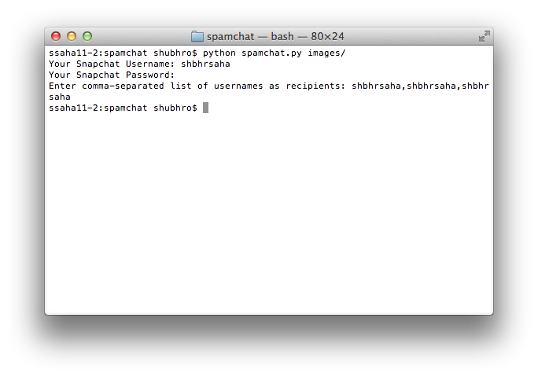
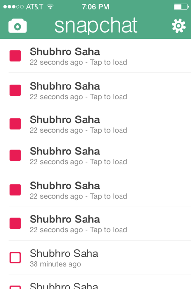

Spamchat
========

Spamchat snaps images from your local computer to your friends over Snapchat.

What You See
---

What Your Friends See
---

Usage
-----
Install the required libraries with:

    pip install -r requirements.txt

Download images from Bing Images with download_images.py or add images yourself to the images/ folder

Send the snaps with:

    python spamchat.py images/

Tested with Python 2.7.5.

Advice
---
Spamchat does not condone spam. Use at your own risk.
